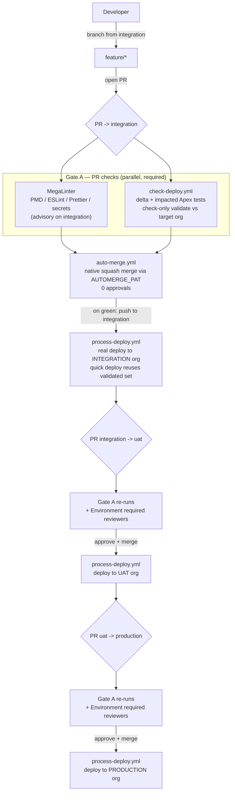

# CI/CD Pipeline — Visual Reference

> Companion to [`DEVOPS-PLAN.md`](DEVOPS-PLAN.md). This file is the *as-built* view of the
> GitHub Actions + sfdx-hardis workflows shipped in [`template/.github/workflows/`](../template/.github/workflows/).
> The plan explains **why** (decisions, gates, trade-offs); this diagram shows **how** the three
> workflows wire together at runtime. Gate labels below map 1:1 to [DEVOPS-PLAN.md §4](DEVOPS-PLAN.md#4-pipeline-stages--gates).

## Promotion flow and gates

## Notes

- **Gate A** ([`check-deploy.yml`](../template/.github/workflows/check-deploy.yml) +
  [`mega-linter.yml`](../template/.github/workflows/mega-linter.yml)) runs on every PR to a major
  branch. `check-deploy` performs a delta deploy in `--check` mode (nothing is deployed) against the
  target branch's org and runs the impacted Apex tests; MegaLinter covers lint/format/secrets.
- **Two distinct triggers**: `pull_request` fires the checks; `push` to a major branch fires
  [`process-deploy.yml`](../template/.github/workflows/process-deploy.yml) (the real deploy). The
  merge is what turns one into the other.
- **integration** uses [`auto-merge.yml`](../template/.github/workflows/auto-merge.yml): GitHub
  native merge via `AUTOMERGE_PAT` (not `GITHUB_TOKEN`, whose merge wouldn't trigger
  `process-deploy`), 0 approvals, waits only on the deployability check turning green.
- **uat / production** require *required reviewers* configured through GitHub Environments (branch
  name = Environment name) — human approval blocks the `process_deployment` job until sign-off. These
  are the plan's **Gate C** (UAT acceptance) and **Gate D** (production, Quick Deploy).
- **Quick Deploy** reuses the PR validation, skipping Apex test re-runs (`SFDX_HARDIS_QUICK_DEPLOY`,
  default `true`).
- major↔major promotions (integration→uat→prod) follow the PR flow; delta requires healthy branch
  topology (`feature → PR → merge`, no merging the target branch back into the feature before the PR).

## Mapping to the plan

| Diagram node | DEVOPS-PLAN.md |
|---|---|
| Gate A — PR checks | [§4 Gate A](DEVOPS-PLAN.md#4-pipeline-stages--gates) |
| deploy to INTEGRATION org | [§4 Gate B](DEVOPS-PLAN.md#4-pipeline-stages--gates) (full regression on merge) |
| PR integration → uat + reviewers | [§4 Gate C](DEVOPS-PLAN.md#4-pipeline-stages--gates) (UAT acceptance sign-off) |
| PR uat → production + reviewers | [§4 Gate D](DEVOPS-PLAN.md#4-pipeline-stages--gates) (prod Quick Deploy) |
| branching (feature/integration/uat/production) | [§3 Branching model](DEVOPS-PLAN.md#3-branching-model-sfdx-hardis-major-branch-convention) |
